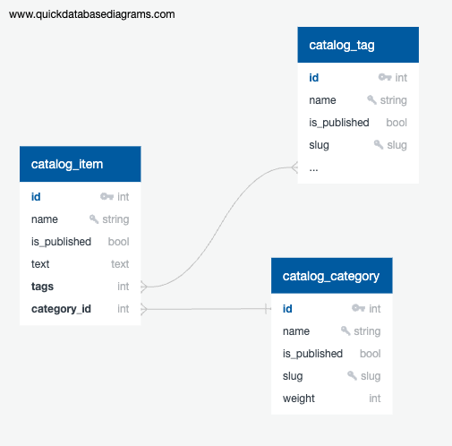

[](https://gitlab.crja72.ru/django/2024/spring/course/students/67134-xxtornexx2016-course-1112/-/commits/main)

# Some shop

Online-store-like website  
Description to be completed

# Database structure
In the DB there are 5 main tables: Item, Category, Tag, MainImage, Image

You can find fixtures at lyceum/fixtures/data.json

  

# Dependencies  
You can find dependencies list in the requirements folder  
Dependencies are separated to 3 files:  
- dev.txt - dependencies for developing  
- prod.txt - dependecies for running project  
- test.txt - dependencies for testing: linting and tests expanding  

# Enviroment variables  
In example.env file you can next vars:
- DJANGO_SECRET_KEY - Django secret key. Default value is "fake-key"
- DJANGO_DEBUG - True to enable debug mode. Default value is True
- DJANGO_ALLOWED_HOSTS - Default value is [localhost, 127.0.0.1, [::1]]
- DJANGO_ALLOW_REVERSE - True to enable middleware reversing all russian words in every 10th response. Default value is True


# Deployment
If you want to deploy the app you should follow these steps

### Clone repo

You can clone via https:  
```bash
git clone https://gitlab.crja72.ru/django/2024/spring/course/students/67134-xxtornexx2016-course-1112.git Dir_name
```  

Or you can clone via ssh:  
```bash
git clone git@gitlab.crja72.ru:django/2024/spring/course/students/67134-xxtornexx2016-course-1112.git Dir_name
```  

"Dir_name" is a custom name for dir which will contain code of the repo  
You can set your own name or delete the attribute to set default name(repo's name)  

Next move to the project dir
```bash
cd Dir_name
```


### Set configuration
Create .env file by renaming the example one  
```bash
mv .env.example .env
```
Change .env variables if you want (variables description see above)

### Set up a virtual environment
Make sure you got a new pip version
```bash
python3 -m pip3 install --upgrade pip3
```
Create venv dir and activate it
```bash
python3 -m venv venv  
source venv/bin/activate  
```
Install dependencies sufficient to run the app
```bash
pip3 install -r requirements/prod.txt  
```

### Colect static

Developer static files are stored at lyceum/static_dev

To run in production change STATIC_URL and STATIC_DIRS in lyceum/settings.py if needed, then use
```bash
cd lyceum
python3 manage.py collectstatic
```

### Run the app
Switch to the project dir if needed
```bash
cd lyceum
```
Run
```bash
python3 manage.py runserver
```

# Testing
### Tests structure  
You can find tests in app dirs(about, catalog, homepage) and project dir(lyceum)  

- test_context.py - testing template context  
- test_models.py - testing models creation and validators  
- test_views.py -  testing endpoints and path converters   
- test_middleware.py - testing custom middlewares  

### Running tests  
To run tests you should switch to lyceum dir
```bash
cd lyceum
```
Then run tests
```bash 
python3 manage.py test
```
